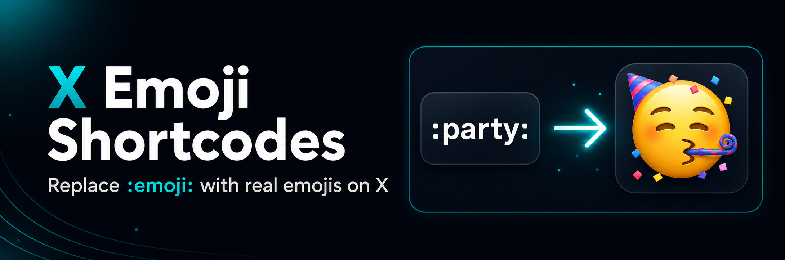

# X Emoji Shortcodes

Replace `:emoji:` shortcodes with real emojis while writing posts on X.

The shortcode list is based on Gemoji, the widely used GitHub emoji dataset.

## Why

I missed a tiny nerdy feature on X: typing emojis with `:emoji:` shortcodes. I tried asking X to add this small feature, but I am apparently too small to be noticed. :D So I built a browser extension for it myself.

## Disclaimer

⚠️ This module is vibe coded and provided as-is. Use it at your own risk.

Example:

```text
:party: -> 🥳
:rocket: -> 🚀
:fire: -> 🔥
```

## Features

- Replaces complete shortcodes like `:party:`, `:rocket:`, and `:fire:` while you write.
- Shows an autocomplete dropdown while typing partial shortcodes like `:pa`.
- Supports keyboard selection with Arrow Up, Arrow Down, Enter, Tab, and Escape.
- Supports mouse selection from the suggestion dropdown.
- Uses the Gemoji shortcode dataset with more than 2,300 generated aliases.
- Adds practical aliases such as `:flag_de:` in addition to Gemoji's `:de:`.
- Runs locally in the browser with no analytics and no external API calls.
- Requires no extension permissions beyond the supported X/Twitter content pages.

## Install locally

### Chrome / Chromium

1. Open `chrome://extensions`.
2. Enable developer mode.
3. Click "Load unpacked".
4. Select this repository folder.

### Firefox

1. Open `about:debugging#/runtime/this-firefox`.
2. Click "Load Temporary Add-on".
3. Select `manifest.json`.

## Supported sites

- `https://x.com/*`
- `https://twitter.com/*`

## Shortcodes

The extension ships with the generated shortcode map in `src/emoji-map.js`.
Run `npm run build:emoji-map` after updating `gemoji`.

## Development

```bash
npm install
npm test
npm run package
```

The package command creates a browser-extension ZIP in `dist/`.

## Privacy

The extension does not collect, store, or transmit personal data. See [PRIVACY.md](PRIVACY.md).

## License

MIT
