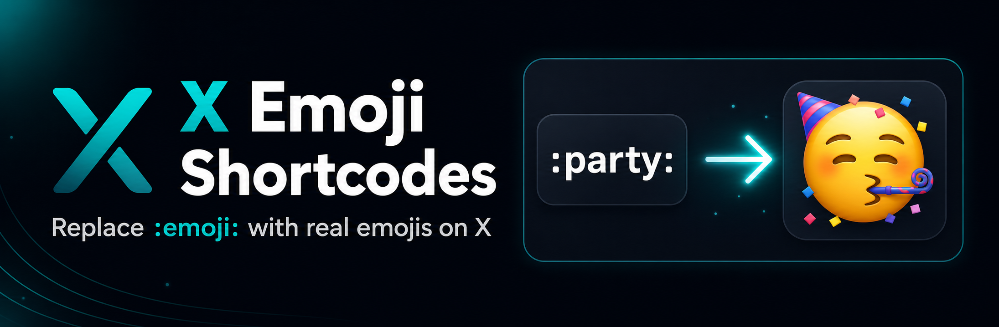

# X Emoji Shortcodes

Replace `:emoji:` shortcodes with real emojis while writing posts on X.

The shortcode list is based on Gemoji, the widely used GitHub emoji dataset.

## Disclaimer

This module is vibe coded and provided as-is. Use it at your own risk.

Example:

```text
:party: -> 🥳
:rocket: -> 🚀
:fire: -> 🔥
```

## Install locally

### Chrome / Chromium

1. Open `chrome://extensions`.
2. Enable developer mode.
3. Click "Load unpacked".
4. Select this repository folder.

### Firefox

1. Open `about:debugging#/runtime/this-firefox`.
2. Click "Load Temporary Add-on".
3. Select `manifest.json`.

## Supported sites

- `https://x.com/*`
- `https://twitter.com/*`

## Shortcodes

The extension ships with the generated shortcode map in `src/emoji-map.js`.
Run `npm run build:emoji-map` after updating `gemoji`.

## License

MIT
